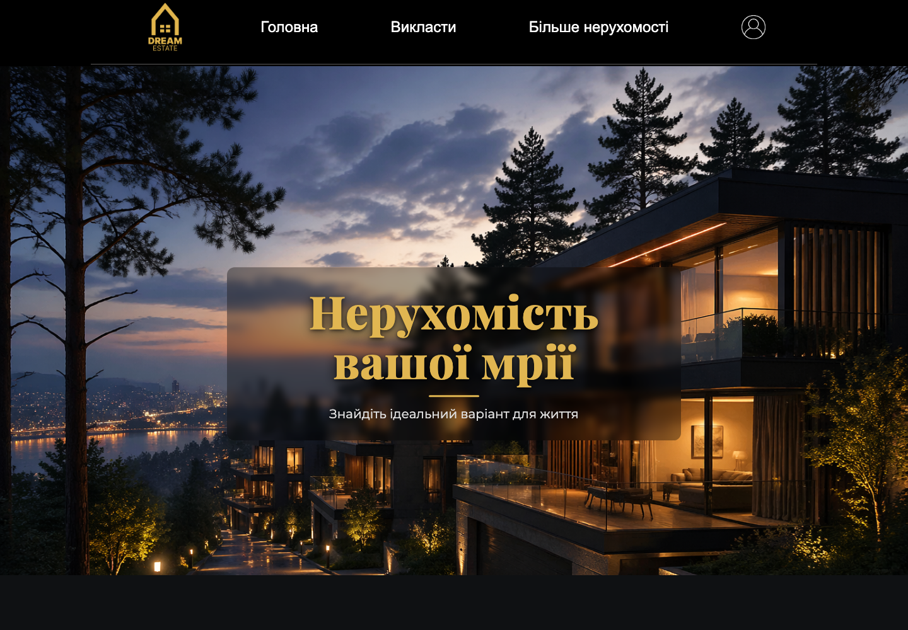
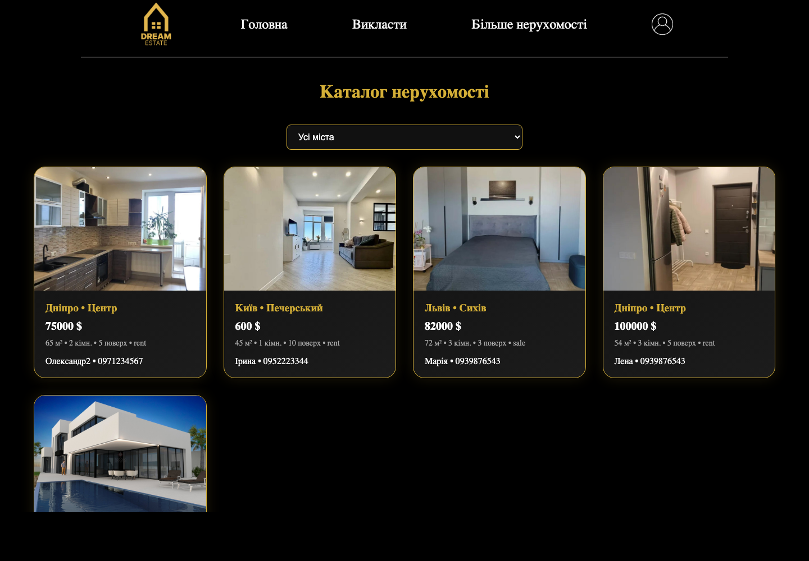
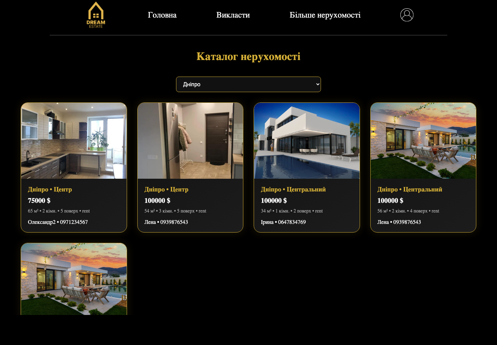
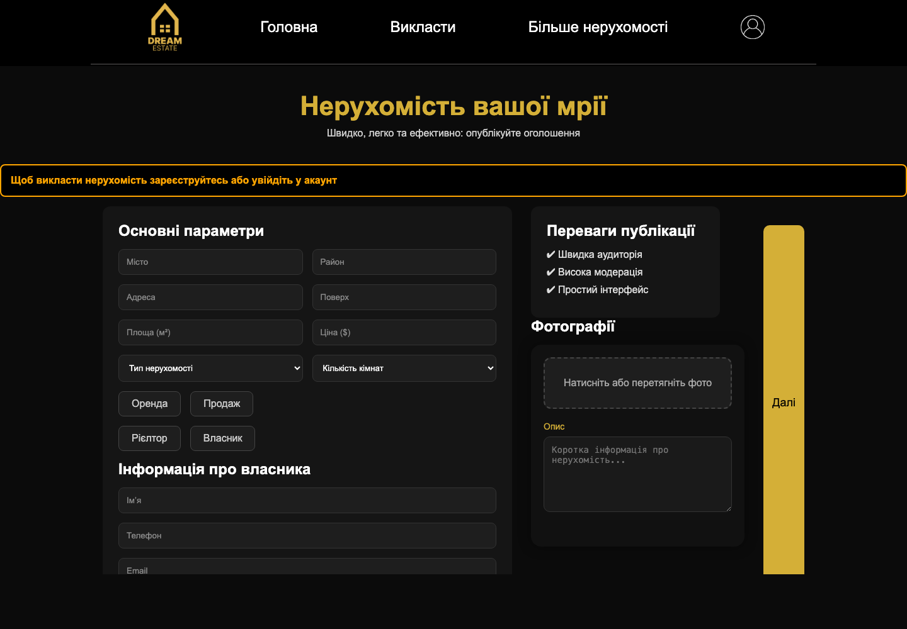

# Real Estate Website


Real Estate Website is a Flask web app for publishing, browsing, and managing real estate listings. The project includes registration, login, property publishing, a paginated catalog, city filtering, property detail pages, user profiles, and an admin screen.

<p align="center">
  
</p>

## Preview

### Home Page


### Catalog Page



### City Filter



### Publish Page



## Features

- Public home page with real estate visuals and listing cards
- User registration with email verification code
- Login and profile pages
- Property publishing form with city, district, address, price, rooms, owner contacts, description, and images
- Catalog with pagination
- Catalog filtering by existing cities
- Property detail page with images and contact information
- User profile page with the current user's listings
- Admin page for creating and deleting listings when `User.isAdmin=True`

## Tech Stack

- Python
- Flask
- Flask-Login
- Flask-Mail
- Flask-SQLAlchemy
- Flask-Migrate
- SQLite
- Jinja2
- HTML/CSS
- Vanilla JavaScript
- `python-dotenv`

## Project Structure

```text
real-estate-website/
├── README.md
├── manage.py
└── Project/
    ├── manage.py
    ├── Project/
    │   ├── __init__.py
    │   ├── config_page.py
    │   ├── db.py
    │   ├── loginmanager.py
    │   ├── settings.py
    │   ├── templates/
    │   ├── static/
    │   └── migrations/
    ├── home/
    │   ├── templates/
    │   └── static/
    ├── catalog/
    │   ├── templates/
    │   └── static/
    └── publish/
        ├── templates/
        └── static/
```

## App Modules

- `Project/Project/`: Flask app setup, configuration, database, login manager, routes, shared templates
- `Project/home/`: home page, registration, verification, login, profile, edit page
- `Project/catalog/`: catalog page, city filtering, pagination, detail page, admin page
- `Project/publish/`: property publishing form and uploaded listing images

## Getting Started

### 1. Create a virtual environment

```bash
python -m venv .venv
source .venv/bin/activate
```

### 2. Install dependencies

```bash
pip install Flask Flask-Login Flask-Mail Flask-SQLAlchemy Flask-Migrate python-dotenv
```

### 3. Create `.env`

Create a `.env` file in the repository root:

```env
MAIL=your-email@gmail.com
PASSWORD=your-app-password
DB_INIT=flask --app Project:project db init
DB_MIGRATE=flask --app Project:project db migrate -m "Initial migration"
DB_UPGRADE=flask --app Project:project db upgrade
```

| Variable | Required | Purpose |
| --- | --- | --- |
| `MAIL` | Yes | Email address used by Flask-Mail |
| `PASSWORD` | Yes | SMTP password or Gmail app password |
| `DB_INIT` | Optional | Migration initialization command |
| `DB_MIGRATE` | Optional | Migration generation command |
| `DB_UPGRADE` | Optional | Database upgrade command |

### 4. Run the project

```bash
cd Project
python manage.py
```

Open:

```text
http://127.0.0.1:8000/
```

## Main Routes

| Route | Purpose |
| --- | --- |
| `/` | Home page |
| `/register/` | Registration |
| `/verify/` | Email code verification |
| `/login/` | Login |
| `/profile/` | User profile |
| `/publish` | Publish a property |
| `/catalog/` | Paginated catalog |
| `/catalog/?city=<city>` | Catalog filtered by city |
| `/catalog/<id>/` | Property detail page |
| `/admin/` | Admin listing management |
| `/delete/?id=<id>` | Delete listing from admin page |

## Catalog Filtering

The catalog filter uses a city dropdown filled from existing listings in the database. When a city is selected, JavaScript submits the filter form and Flask applies the filter before pagination.

Example:

```text
/catalog/?city=Дніпро&page=1
```

This keeps pagination correct because every page link preserves the selected city.

## Database

- Database: SQLite
- Default file: `Project/Project/instance/data.db`
- ORM: Flask-SQLAlchemy
- Migrations: Flask-Migrate / Alembic

The app stores users and published real estate listings.

## Future Improvements

- Add automated tests for registration, publishing, catalog filtering, and profile pages
- Hash and validate passwords securely
- Improve admin role management
- Add property editing and status controls
- Add production deployment configuration
